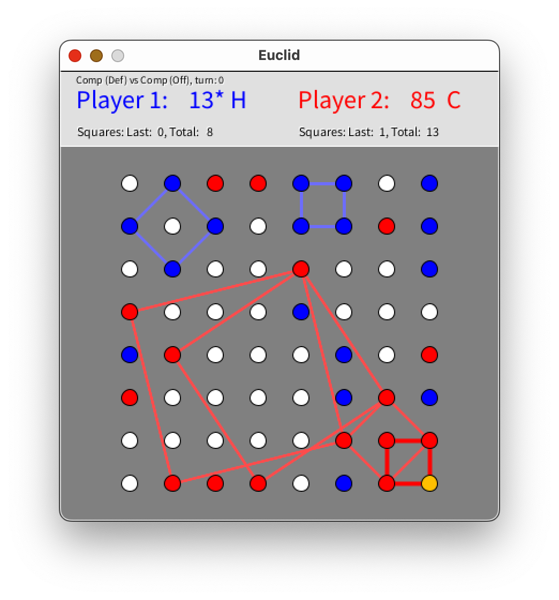

# Euclid
Great 1 or 2 player puzzle game written in Java for the Processing IDE/environment.

The goal is to create the largest symmetrical squares on the board in any orientation by taking the spots in a turn based manner. With the right strategies one spot can create multiple squares at once. 

Includes playing against the engine itself.

Use the mouse to select your move and then the computer will make it's move. The last move made is highlighted in orange. All other spots are colored red or blue depending on which side owns the spot.

The first player to 150 wins but this can be changed in the code. Points are awarded by the area of the squares made. Bigger squares make more points.

3 playing styles for the computer: Offensive makes the best moves to win, Defensive makes the best moves to block your almost completed squares, Beginner mode is offensive but makes occasional mistakes randomly.
Special keystrokes are also supported:
 * Q - Quit
 * C - Toggle between whether the current player is human or computer. 
    Toggling both to computer makes it play itself
 * N - New Game
 * T - Toggle whose turn it is: player 1 or player 2
 * P - Select playing style of compuer: Offensive, Defensive, Beginner (makes mistakes)
 * U - Undo last move
 * Space - Have the computer make a move for you

